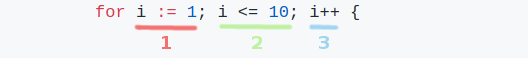
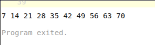

## Notre premier programme

Vous avez compris que les lignes de code, qui se trouvent dans le bloc jaune,
sont responsables de l'affichage. 

Voyons comment nous pouvons écrire un programme un peu plus compliqué :
affichons la table de multiplication du nombre 7. J'ai toujours du mal à la
retenir :-)

Commençons par effacer entièrement le programme existant.

1. Cliquez à l'intérieur du bloc jaune

2. Sélectionnez tout le contenu à la souris ou avec le raccourci clavier Ctrl+A
   (Windows ou Linux) ou Cmd+A (Mac)

3. Appuyez sur la touche **Suppr** du clavier

Maintenant, nous avons un espace vide rien que pour nous.

Ecrivons la ligne suivante :

```go
package main
```

**package main** signifie "paquet principal" : pour le moment, retenons que,
pour fonctionner, notre programme doit faire partie du paquet principal. Plus
tard, les paquets nous intéresseront pour leur capacité à organiser notre
programme.

Passons à la ligne (touche **Entrée**) et entrons la suite : 

```go
func main() {
```

Le mot **func** introduit une fonction. 

Chaque fonction porte un nom, ici **main**.

Une fonction permet de regrouper du code. Tout ce qui se trouve entre
l'accolade ouvrante et fermante fait partie de la fonction.

Nous verrons plus en détail à quoi servent les fonctions.

Pour l'instant, retenons que la fonction **main** a une propriété particulière
pour Go car c'est là que débutera notre programme.

Continuons notre programme en tapant à la ligne :

```go
	for i := 1; i <= 10; i++ {
```

**for** nous permet de définir une boucle. 

Une boucle répéte plusieurs fois le code qui se trouve entre accolades.

Pour cela, **for** a besoin de 3 parties séparées par un point-virgule :



1. **i := 1** : une variable que l'on nomme **i** et à laquelle on affecte la
   valeur 1. Une variable est une case mémoire dans laquelle on peut stocker
   une donnée pour la manipuler.

2. **i <= 10** indique que l'on tourne dans la boucle tant que notre variable
   ne dépasse pas **10**.

3. **i++** fera avancer notre variable **i** de 1 en 1, à chaque tour de
   boucle.

Notre variable **i** va donc prendre les valeurs 1 puis 2, 3, ... etc, jusqu'à
10.

Allons à la ligne pour écrire le code qui sera répeté :

```go
		print(i*7, " ")
```

**print** affiche un contenu à l'écran. 

Le contenu a afficher se trouve entre parenthèses :

* __i * 7__, la variable i qu'on multiplie par 7

* " ", un petit espace pour que nos nombres ne s'affichent pas collés les
  uns aux autres.

**Deux remarques** : 

1. La multiplication est représentée par une petite étoile *, et non une
   croix comme on en a l'habitude. Les autres opérations arithmétiques sont
   **+** et **-**, sans surprise, mais **/** pour la division. 

2. Notre petit espace est entouré par des guillemets. C'est ainsi qu'on
   délimite une chaine de caractères, notion qu'on aura l'occasion de
   recroiser.

Comme **i** vaut 1 au début de notre boucle, on affichera 1*7, soit 7.

Puis **i** passe à 2, et on affichera 2*7, soit 14.

Et ainsi de suite jusqu'à ce que **i** vaut 10, pour afficher 70.

N'oubliez pas d'ajouter les 2 accolades fermantes : une pour fermer l'accolade
ouvrante de la ligne **for** et l'autre pour la ligne **func**.

Appuyez sur le bouton **Format** pour que votre code soit mieux présenté.

Vous devriez obtenir le programme complet suivant :

```go
package main

func main() {
	for i := 1; i <= 10; i++ {
		print(i*7, " ")
	}
}
```

Appuyez sur **Run** ou Shift+Enter et voilà le résultat de notre premier
programme en Go :

 

Si vous n'obtenez pas ce résultat, ou qu'un message d'erreur en anglais
s'affiche, pas de panique ! Cela arrive tout le temps quand on programme et
voici ce que l'on doit faire :

1. Lisez le message d'erreur pour repérer le numéro de la ligne incriminée et
   le type d'erreur.

2. Relisez attentivement votre code, et faites très attention aux ponctuations
   : par exemple une virgule à la place d'un point-virgule, aux oublies de
   signes comme une parenthèse fermante, ou aux fautes d'orthographes,
   **primt** n'est pas **print**.

3. A chaque fois que vous corrigez, relancez le programme pour 
vérifier que cela marche (**Run** ou Shift+Enter).

4. Si cela ne fonctionne pas, n'hésitez pas à copier/coller le programme
   complet ci-dessus.

__En résumé__

Nous avons appris à nous servir du bac-à-sable du langage Go, pour écrire un
programme, l'exécuter et consulter le résultat.

Nous avons aussi fait connaissance avec quelques mots de ce langage pour
afficher des données à l'écran (**print**) ou pour répéter plusieurs fois les
mêmes actions (**for**).

Nous avons également effleurer plusieurs notions que nous approfondirons plus
tard, comme les paquets (**package**), les fonctions (**func**) ou encore les
variables.

[La suite en exercice](./01_30_Exercices.md) : suivie de la correction !
