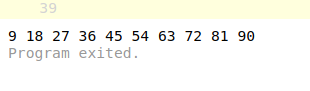
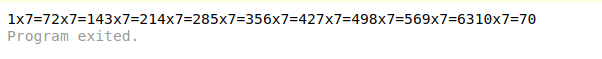
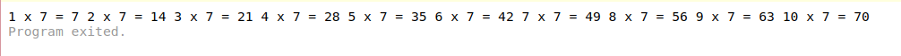
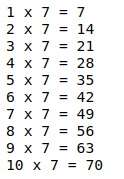
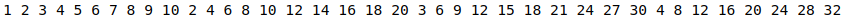
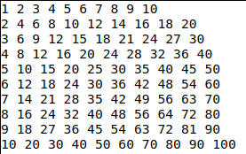
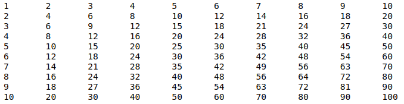

# Initiation à la programmation informatique - Partie 2

La dernière fois, nous avons débuté la programmation. Grâce au bac-à-sable Go, nous avons écris et exécuté un programme qui affiche la table de multiplication par 7. Nous avons finis sur quelques exercices à faire et ici nous allons les corriger.

## Exercice 1 : afficher d'autres tables de multiplication

Notre dernier programme se présentait ainsi :

```go
package main

func main() {
	for i := 1; i <= 10; i++ {
		print(i*7, " ")
	}
}
```

Si nous voulons afficher la table de 9, par exemple, il n'y a qu'une modification à faire : changez le **i*7** dans l'instruction **print**, par **i*9**, comme suit :

```go
package main

func main() {
	for i := 1; i <= 10; i++ {
		print(i*9, " ")
	}
}
```

En exécutant le programme (bouton **RUN** ou SHIFT+ENTER), on obtient :



Et donc, pour obtenir les autres tables, on applique la même méthode, en remplaçant le terme dans l'instruction **print**.

## Exercice 2 : expliciter l'opération de multiplication

Pour cet exercice, plutôt que de n'afficher que le résultat, on veut afficher toute l'opération, par exemple **4 x 7 = 28**.

On a vu qu'on pouvait afficher plusieurs données dans l'instruction **print** en les séparant par une virgule, comme dans notre ligne qui affiche le résultat :

```go
	print(i*7, " ")
```

Pour afficher l'opération, on doit d'abord afficher le premier terme, suivi d'un signe "x" puis le deuxième terme, suivi du signe "=" et enfin le résultat.

Ce qui donnerait :

```go
	print(i, "x", 7, "=", i*7)
```

Plaçons cette ligne dans notre programme et nous obtenons :

```go
package main

func main() {
	for i := 1; i <= 10; i++ {
		print(i, "x", 7, "=", i*7)
	}
}
```

Exécutons le programme pour vérifier que tout est bon :

 

Pas terrible. Tout est collé.

Ajoutons quelques espaces dans notre ligne **print**, autour du signe "x", du signe "=", et après le résultat :

```go
	print(i, " x ", 7, " = ", i*7, " ")
```

Cela donne :



C'est mieux mais pas très lisible. L'idéal serait de sauter une ligne après chaque opération.

Un **print** avec le code spécial **"\n"** sert justement à ça.

Changeons notre ligne comme suit en ajoutant notre code spécial :

```go
	print(i, " x ", 7, " = ", i*7, "\n")
```

Pour un résultat plus convainquant :



Voilà le programme au complet :

```go
package main

func main() {
	for i := 1; i <= 10; i++ {
		print(i, " x ", 7, " = ", i*7, "\n")
	}
}
```

## Exercice 3 : afficher toutes les tables sous forme d'un tableau

Pour ce dernier exercice, on veut afficher toutes les tables de multiplication de 1 à 10, sous la forme d'un tableau comme suit :

```
1	2	3	4	5	6	7	8	9	10	
2	4	6	8	10	12	14	16	18	20	
3	6	9	12	15	18	21	24	27	30	
4	8	12	16	20	24	28	32	36	40	
5	10	15	20	25	30	35	40	45	50	
6	12	18	24	30	36	42	48	54	60	
7	14	21	28	35	42	49	56	63	70	
8	16	24	32	40	48	56	64	72	80	
9	18	27	36	45	54	63	72	81	90	
10	20	30	40	50	60	70	80	90	100	
```

Une première approche pourrait être de partir de l'exercice 1 et de dupliquer les lignes comme suit :

```go
package main

func main() {
	for i := 1; i <= 10; i++ {
		print(i*1, " ")
	}
	for i := 1; i <= 10; i++ {
		print(i*2, " ")
	}
	for i := 1; i <= 10; i++ {
		print(i*3, " ")
	}
...
```

Et l'on répéterait le bloc 10 fois, en changeant à chaque fois, le terme de la multiplication.

Mais cette approche, même si elle marche, n'est pas bonne. En informatique, on doit éviter de dupliquer du code !

En regardant de plus près, on peut voir que seul le terme de la multiplication change à chaque fois. Il passe de 1 à 10. Tout le reste est identique.

Et là, cela nous fait penser à l'instruction **for** qui peut faire passer une variable par différentes valeurs.

Nous devons donc écrire un **for** pour le premier terme de la multiplication, qui englobe un autre **for** pour le second terme. 

```go
	for i := 1; i <= 10; i++ {
		for j := 1; j <= 10; j++ {
			...
		}
	}
```

Vous devez faire attention à ne pas utiliser la même variable. Ici, j'utilise **i** et **j** pour indiquer les 2 termes de ma multiplication.

On va maintenant s'intéresser à ce qu'on affiche : on veut le résultat de la multiplication de nos 2 termes, donc on veut le résultat de **i** x **j**. On devrait écrire :

```go
	...
	print(i*j, " ")
	...
```

Remettons tout ça en forme et voyons ce que cela donne. Notre programme devrait ressembler à ça maintenant :

```go
package main

func main() {
	for i := 1; i <= 10; i++ {
		for j := 1; j <= 10; j++ {
			print(i*j, " ")
		}
	}
}
```

Et une fois exécuté, nous avons :



Tous les résultas s'enchainent sur une même ligne ! Or nous voulions qu'à chaque nouvelle table, on saute de ligne.

Pas de problème, nous avons déjà vu comment sauter de ligne plus haut. Il suffit d'ajouter le saut juste après l'affichage d'une table comme suit :

```go
package main

func main() {
	for i := 1; i <= 10; i++ {
		for j := 1; j <= 10; j++ {
			print(i*j, " ")
		}
		print("\n")
	}
}
```
Remarquez l'ajout de la ligne **print("\n")** juste après le **for** intérieur.

Qu'obtient-on ?



Le tableau est mal aligné parce-que tous les nombres n'ont pas la même taille. 

On peut améliorer l'affichage avec la tabulation. En utilisant le code "\t" à la place de l'espace de séparation, on demande d'afficher les infos qui suivent à la prochaine tabulation.

Utilisons cela dans notre programme :

```go
package main

func main() {
	for i := 1; i <= 10; i++ {
		for j := 1; j <= 10; j++ {
			print(i * j, "\t")
		}
		println()
	}
}
```

Et voilà un résultat plus que satisfaisant :



## Conclusion

Nous avons vu comment progressivement améliorer notre code, en essayant une modification, en analysant le résultat et en recommençant jusqu'à satisfaction.

Nous avons approfondis nos connaissances de l'instruction **for** et des variables, et appris au passage quelques codes d'affichage utiles comme le saut de ligne "\n" et la tabulation "\t".

Et nous avons appliqué une bonne pratique de programmation en évitant de dupliquer du code !

Pour la prochaine fois, nous verrons un peu plus la notion de variables, comment les déclarer et comment les manipuler.
