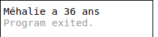
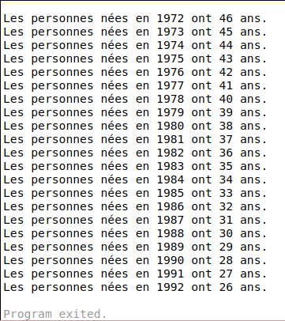

# Initiation à la programmation informatique - Partie 4

Après une partie 3 plus théorique, nous allons, dans cette partie, illustrer ces notions pour écrire un programme de calcul d'âge.

## Exercice 1 : calculer un âge

On nous donne l'année de naissance de la personne et on suppose que l'on connait l'année en cours.

Pour faire simple, nous n'allons pas tenir compte du mois et du jour. 

On nous donne également son prénom, par exemple "Méhalie".

On voudrait afficher quelque chose comme suit :

    Méhalie a 36 ans

Calculer l'âge d'une personne, c'est soustraire son année de naissance de l'année en cours : 

    année en cours - année de naissance. 

Traduisons tout cela en code. 

Nous avons besoin de 3 variables : le prénom, l'année de naissance et l'année en cours.

```go
    prenom     := "Méhalie"
    naissance  := 1982
    maintenant := 2018
```

On commence par définir la variable _prenom_ pour stocker le prénom de la personne. 

Puis on définie la variable _naissance_ qui sera son année de naissance.

Et enfin, on déclare la variable _maintenant_ qui va contenir l'année en cours.

Comme on l'a déjà vu, Go déduit automatiquement le type de chaque variable : _string_ pour _prenom_ et _int_ pour _naissance_ et _maintenant_.

Pour obtenir l'âge, on soustrait les 2 variables :

```go
    age := maintenant - naissance
```

Le résultat de la soustraction étant aussi un entier, "age" prendra le type _int_. Le résultat est alors affiché à l'aide de l'instruction _print_ :

```go
    print(prenom, " a ", age, " ans")
```

Voilà ce que donne le programme en entier :

```go
package main

func main() {
    prenom     := "Méhalie"
    naissance  := 1982
    maintenant := 2018
    age := maintenant - naissance
    print(prenom, " a ", age, " ans")
}
```
Pour le résultat suivant :



## Exercice 2 - calculer l'âge pour la génération 1972 - 1992

Cette fois, on veut afficher l'âge des personnes nées entre 1972 et 1992, sous la forme :

```
    Les personnes nées en 1972 ont 46 ans.
    Les personnes nées en 1973 ont 45 ans.
    ...
```

On a déjà vu, qu'en informatique, on devait éviter de répéter le code. Une boucle nous aiderait à énumérer les années de naissance, de 1972 à 1992.

On pourrait écrire :

```go
    for naissance := 1972; naissance <= 1992; naissance ++ {
    ...
```

Ce que l'on pourrait traduire par la variable **naissance** prend la valeur 1972 au départ et 1992 à la fin, en avançant de 1 en 1.

Ok, on a notre boucle. 

Si on reprend notre calcule d'aĝe plus haut, on devrait avoir à l'intérieur de la boucle quelque chose comme suit :

```go
    ...
    age := maintenant - naissance
    print("Les personnes nées en ", naissance, " ont ", age, " ans.")
```

Comme **naissance** va prendre successivement les valeurs 1972, 1973, ... jusqu'à 1992, on calculera, à chaque tour de boucle, l'âge correspondant, et on affichera le résultat à l'écran.

Voilà le programme en entier :

```go
package main

func main() {
	maintenant := 2018
	for naissance := 1972; naissance <= 1992; naissance++ {
		age := maintenant - naissance
		print("Les personnes nées en ", naissance, " ont ", age, " ans.")
	}
}
```

Si on l'exécute, on remarque qu'on a oublié le saut de ligne.

Remédions à cela en ajoutant le code spécial saut de ligne "\n" :

```go
package main

func main() {
	maintenant := 2018
	for naissance := 1972; naissance <= 1992; naissance++ {
		age := maintenant - naissance
		print("Les personnes nées en ", naissance, " ont ", age, " ans.\n")
	}
}
```

Et voilà le résultat :

